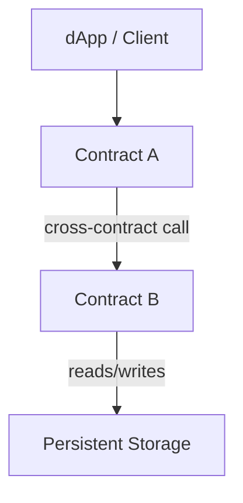

# CodeGraph

> Open-source code intelligence for understanding Stellar/Soroban codebases through architecture graphs.

[](https://github.com/codegraph-org/CodeGraph/actions/workflows/ci.yml)
[](https://opensource.org/licenses/MIT)

CodeGraph statically analyzes Soroban smart contracts and transforms their structure, authorization boundaries, storage access, and contract relationships into a machine-readable architecture graph.

The goal is simple:

**Make complex Soroban codebases easier to understand, inspect, document, and maintain.**

---

## Why CodeGraph?

As Stellar/Soroban applications grow, understanding their architecture can become difficult.

A project may contain multiple contracts, Rust crates, authorization boundaries, storage operations, and cross-contract calls. Developers and maintainers often need to manually trace these relationships across many files.

CodeGraph provides a static, reproducible view of these relationships.

It helps developers:

- Understand unfamiliar Soroban codebases faster
- Explore contract and function relationships
- Inspect authorization boundaries
- Identify state-changing functions
- Analyze storage access
- Track cross-contract dependencies
- Detect potentially risky patterns
- Generate architecture documentation
- Export architecture data for other tools

---

## What CodeGraph Does

### Soroban/Rust Analyzer

CodeGraph analyzes Rust/Soroban source code and extracts information such as:

- Soroban contracts
- Contract functions
- Authorization checks
- State mutations
- Storage access
- Contract calls
- Rust workspace structure

The analyzer operates statically and does not execute repository code.

### Architecture Graph

Analysis results are converted into a structured graph containing:

- Nodes representing contracts, functions, and other code entities
- Edges representing relationships between entities
- Authorization information
- Storage relationships
- Contract-to-contract interactions

The graph can be consumed by other tools or visualized through supported graph formats.

### Health Checks

CodeGraph includes heuristic checks for potentially problematic patterns.

For example:

```text
[WARNING] no-auth-state-change

Contract: MissingAuthContract
Method: update_state

Reason:
The method mutates state without a detected require_auth call.
```

These checks are intentionally heuristic and should be reviewed by developers before being treated as security findings.

### Documentation Generation

CodeGraph can generate an `ARCHITECTURE.md` file from the analyzed graph.

This provides a reproducible architecture overview without requiring developers to manually maintain the document.

### Graph Export

Graph data can currently be exported to formats such as:

- Mermaid
- DOT

This allows generated architecture information to be used in:

- Documentation
- Wikis
- Design discussions
- Graph visualization tools
- CI workflows

---

## Current Status

CodeGraph is under active development.

### Currently Available

- [x] Soroban/Rust static analysis
- [x] Contract detection
- [x] Function detection
- [x] `require_auth` detection
- [x] State mutation detection
- [x] Storage access detection
- [x] Graph generation
- [x] JSON graph output
- [x] Mermaid export
- [x] DOT export
- [x] Architecture documentation generation
- [x] Initial health heuristics
- [x] Rust workspace traversal

### In Development

- [ ] Improved cross-contract call resolution
- [ ] Interactive graph viewer
- [ ] Better graph exploration and filtering
- [ ] Additional Soroban analysis capabilities
- [ ] TypeScript/dApp analysis
- [ ] Architecture change tracking

---

## Example Architecture

A Soroban codebase can be represented as a graph such as:



The underlying graph is emitted as structured JSON and can then be exported into visualization or documentation formats.

---

## How It Works

CodeGraph is organized around analyzer packs and a shared graph engine.

```text
┌──────────────────────────────┐
│      Soroban/Rust Code       │
└──────────────┬───────────────┘
               │
               ▼
┌──────────────────────────────┐
│      Analyzer-Soroban        │
│        AST Analysis          │
└──────────────┬───────────────┘
               │
               ▼
┌──────────────────────────────┐
│         Core Engine          │
│      Nodes + Relationships   │
└──────────────┬───────────────┘
               │
        ┌──────┼───────┐
        ▼      ▼       ▼
      JSON   Health   Docs
      Graph  Checks  Generator
        │
        ├──────────► Mermaid
        └──────────► DOT
```

### 1. Analyzer Packs

Language-specific analyzers inspect source code and extract structured information.

The current primary analyzer is:

```text
packages/analyzer-soroban/
```

It focuses on Rust/Soroban codebases.

### 2. Core Engine

The core package takes the extracted entities and relationships and constructs a unified graph representation.

```text
packages/core/
```

### 3. Graph Schema

The resulting graph represents relationships such as:

- Contract → Function
- Function → Function
- Contract → Contract
- Function → Storage
- Function → Authorization
- Cross-contract calls

This structured representation allows the same analysis to power visualization, documentation, and automated checks.

---

## Quick Start

### Requirements

- Node.js
- pnpm
- Git

### Clone the repository

```bash
git clone https://github.com/codegraph-org/CodeGraph.git
cd CodeGraph
```

### Install dependencies

```bash
pnpm install
```

### Build

```bash
pnpm build
```

### Analyze a Soroban project

```bash
node apps/cli/dist/index.js analyze ./path/to/project -o graph.json
```

### Run health checks

```bash
node apps/cli/dist/index.js check graph.json
```

### Generate architecture documentation

```bash
node apps/cli/dist/index.js docs graph.json -o ARCHITECTURE.md
```

### Export a Mermaid graph

```bash
node apps/cli/dist/index.js export graph.json --format mermaid -o graph.mermaid
```

> Note: Replace `node apps/cli/dist/index.js` with the published CodeGraph binary or preferred package runner once the CLI is distributed as a standalone package.

---

## Example Output

A typical analysis can produce output such as:

```text
--- Analysis Coverage ---
Contracts: 2
Functions: 14
Storage Accesses: 6
Cross-Contract Calls: 1

Unresolved Cross-Contract Calls: 0/1

--- Health Checks ---

[WARNING] no-auth-state-change

Contract 'MissingAuthContract'
method 'update_state'
mutates state without calling require_auth.
```

---

## Why Stellar / Soroban?

CodeGraph is designed specifically around concepts that are important when analyzing Soroban applications.

The analyzer currently understands or detects concepts including:

- Soroban contracts
- Contract functions
- `require_auth`
- State mutations
- Storage access
- Cross-contract calls
- Rust workspace structure

The project aims to provide Stellar developers and maintainers with better visibility into how their contracts and application code are connected.

Future development will extend this into richer interactive architecture exploration, improved contract-call resolution, and broader tooling for Stellar/Soroban projects.

---

## Limitations

CodeGraph currently performs static analysis.

### Static Analysis Only

Repository code is analyzed but never executed.

This means runtime behavior and dynamically resolved relationships may not always be visible to the analyzer.

### Cross-Contract Resolution

Cross-contract call resolution is currently incomplete.

Some calls cannot be resolved statically because the target contract or invocation path cannot be determined from the available source information.

See the relevant GitHub issues for current implementation progress.

### Heuristic Findings

Health checks are heuristic by design.

A warning does not necessarily represent a vulnerability or defect. Developers should review the surrounding code and intended behavior before taking action.

### Language Coverage

The primary analyzer currently focuses on Rust/Soroban projects.

Additional language and dApp analyzers are planned.

---

## Project Structure

CodeGraph is organized as a monorepo:

```text
CodeGraph/
│
├── apps/
│   ├── cli/
│   │   └── CLI application
│   │
│   └── web/
│       └── Interactive graph viewer
│
├── packages/
│   ├── core/
│   │   └── Graph builder and analysis engine
│   │
│   ├── analyzer-soroban/
│   │   └── Rust/Soroban analyzer
│   │
│   ├── analyzer-ts/
│   │   └── TypeScript analyzer (planned)
│   │
│   └── shared/
│       └── Shared types and interfaces
│
├── docs/
│   └── Project documentation
│
├── tests/
│   └── Test fixtures and test suites
│
├── CONTRIBUTING.md
├── SECURITY.md
├── CODE_OF_CONDUCT.md
└── LICENSE
```

---

## Roadmap

### Phase 1 — Core Analysis

- [x] Soroban contract detection
- [x] Function detection
- [x] Authorization analysis
- [x] Storage analysis
- [x] Graph generation
- [x] Documentation generation
- [x] Mermaid/DOT export

### Phase 2 — Better Soroban Intelligence

- [ ] Improved cross-contract call resolution
- [ ] Cross-crate resolution
- [ ] Better Rust macro support
- [ ] Improved workspace traversal
- [ ] Expanded Soroban fixtures
- [ ] Additional health heuristics

### Phase 3 — Interactive Visualization

- [ ] Interactive graph viewer
- [ ] Node inspection
- [ ] Graph search
- [ ] Dependency filtering
- [ ] Contract/function navigation
- [ ] Architecture overview

### Phase 4 — Full-Stack dApp Intelligence

- [ ] TypeScript analyzer
- [ ] Frontend-to-contract relationships
- [ ] SDK usage detection
- [ ] Full-stack architecture graphs

### Phase 5 — Architecture Evolution

- [ ] Architecture snapshots
- [ ] Graph comparison
- [ ] Architecture changes across commits
- [ ] Pull-request architecture analysis

---

## Contributing

Contributions are welcome.

CodeGraph is being developed as an open-source project and is structured so contributors can work independently on analyzers, graph functionality, CLI tooling, tests, documentation, and the interactive viewer.

Please read:

- [CONTRIBUTING.md](CONTRIBUTING.md)
- [CODE_OF_CONDUCT.md](CODE_OF_CONDUCT.md)
- [SECURITY.md](SECURITY.md)

### Good First Issues

If you're new to the project, look for issues labelled:

```text
good first issue
```

Current contribution areas include:

- Soroban analyzer improvements
- Cross-contract resolution
- Rust parsing
- Graph engine improvements
- CLI improvements
- Test fixtures
- Documentation
- Frontend visualization

See the [open issues](https://github.com/codegraph-org/CodeGraph/issues) for current tasks.

---

## Development

Run tests:

```bash
pnpm test
```

Run linting:

```bash
pnpm lint
```

Build all packages:

```bash
pnpm build
```

The repository uses CI to validate changes before they are merged.

---

## Security

CodeGraph performs static analysis and does not execute analyzed repository code.

If you discover a security vulnerability in CodeGraph itself, please report it privately rather than opening a public GitHub issue.

See [SECURITY.md](SECURITY.md) for the project's security policy.

---

## License

CodeGraph is released under the MIT License.

See [LICENSE](LICENSE) for details.

---

## Project Vision

CodeGraph aims to become an open-source foundation for understanding the architecture of Stellar/Soroban applications.

The long-term vision is to make architecture a first-class, machine-readable part of the development workflow:

```text
Source Code
     │
     ▼
Static Analysis
     │
     ▼
Architecture Graph
     │
 ┌───┼─────────────┐
 ▼   ▼             ▼
Docs Health    Visualization
     │
     ▼
Architecture Intelligence
```

**Understand the code. See the architecture. Build with confidence.**

---

## Links

- [GitHub Repository](https://github.com/codegraph-org/CodeGraph)
- [Issues](https://github.com/codegraph-org/CodeGraph/issues)